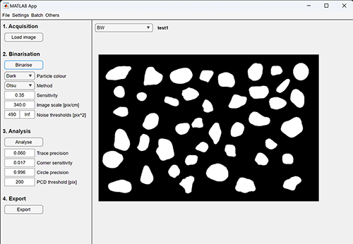

# Rgrains


## 1. Introduction
The shape of particles is one of the essential pieces of information for understanding their characteristics. It is utilised in various fields, such as powder engineering and sedimentology. Because the shape and size of a particle are strongly related to its behaviour and their history, these are treated as crucial information in sedimentology.　　

There have been attempts to quantitatively express the shape of particles since old days. Particularly famous is the "Roundness" defined by Wadell (1932). "Roundness" is a ratio calculated by dividing the average diameter of the small circles that touch the convex parts of a particle's contour by the diameter of the largest inscribed circle, and it is represented in a range of 0-1. Since "Roundness" uses the average of small circles, it is a relatively robust indicator. It focuses on convex parts, making it more sensitive to shape changes than indices calculated from the entire shape of the particle, like "Circularity." Hence, “Roundness” provides valuable information for identifying sediment particles and considering their processes.

However, measuring the "Roundness" of natural particles with complex shapes is difficult and time-consuming. In the era before digital cameras and computers, it was common to use impression diagrams proposed by Krumbein (1941) for semi-quantitative measurements. This diagram added a degree of objectivity to the previously subjective particle shapes, enabling comparative analysis and significantly expanding the field of research. This played a significant role in their time, but they were not entirely objective and did not fully represent the continuous nature of "Roundness."

Recently, with the advancement of digital technologies like cameras and computers, it has become possible to measure various shapes, including the theoretical "Roundness" defined by Wadell, more objectively and quickly. For example, Zheng & Hryciw (2015) succeeded in calculating "Roundness" by fitting small circles to the contours of particles in images. Furthermore, Fukuda & Naruse (2020) succeeded in quantifying shapes by applying Elliptic Fourier Analysis to the contours of particles in images. Thus, with the evolution of digital technologies, particle shape analysis has achieved unprecedented levels of precision and speed.

Rgrains is an image analysis software equipped with a series of functions for extracting contours from images, measuring shapes, and outputting results as images or tables. Rgrains can calculate the area, circularity, major and minor axis lengths of particles. Furthermore, this software, drawing upon Zheng & Hryciw's (2015) innovative techniques, can also calculate "Roundness" according to Wadell's definition. In a way, it can be considered a wrapper software for Zheng & Hryciw (2015)'s program. Ishimura & Yamada (2019) used Rgrains to analyse the shapes of gravel in tsunami deposits, estimating the magnitude of past tsunamis based on the similarity between terrain and particle shapes. In this way, Rgrains equips researchers with a nuanced understanding of particle dynamics, facilitating a deeper exploration of particle behaviour. We sincerely hope that this application, Rgrains, will significantly expand the horizons of scientific inquiry, opening new avenues for research and fostering a deeper, more comprehensive understanding in the field.


## 2. Methods of measuremnt and calculation
### 2.0. Pretreatments
Rgrains can measure and calculate the shape of particles in the image. Binarised images are used for the measurement, but the images must adequately represent the contours of the particles. Suitable images for binarisation are those with sufficient resolution, homogeneous brightness, a deep depth of field, and a large contrast between the particles and the background. Specifically, the major axis lenngth of the particles should be at least 200 pix. In addition, to obtain a homogeneous brightness, high-contrast particle silhouette, the use of backlight panels, such as tracing stands, is suitable. However, any method is acceptable as long as the final result is a binarised image with well-reproduced particle contours. After taking images, the images are binarised using matlab's built-in functions of [imbinarize](https://jp.mathworks.com/help/images/ref/imbinarize.html). Please apply the appropriate method to the image. See link for details.

### 2.1. Area, major/minor length, Circularity and aspect ratio
After binarisation, Rgrains crops out the particle and its surrounding area. At this time, if the PCD normalisation option is enable, it calculates the particle's circumscribed circle and resizes the image so that the size of the circumscribed circle is the size you specified. The cropped binarised image is then measured for its are, major axis length, minor axis length, aspect ration and circularity using matlab's built-in function of [regionprops](https://jp.mathworks.com/help/images/ref/regionprops.html). See link for details.

### 2.2.Roundness
#### 2.2.1. Definition
The roundness is one of the useful parameters for grain shapes. The definition is extremely simple as below.

$$Roundness = \left({1 \over n} \sum_{k=1}^n r_k \right)/R_{max}$$

where $R_{max}$ is the radious of maximum inscribed circle, $n$ is number of corners in the circumference and $r_i$ is the radious of $i$ th corner concaveture.


red: maximum inscribed circle

orange: corner convex curve

green: small circles that fits in the corner concaveture

#### 2.2.2. Calculation
Rgrains calculates "Roundness" using the modified [program](https://jp.mathworks.com/matlabcentral/fileexchange/60651-particle-roundness-and-sphericity-computation) of [Zheng & Hryciw (2015)](https://www.icevirtuallibrary.com/doi/abs/10.1680/geot.14.P.192). See link for details. Briefly, the critical process is divided into three parts:  
1. detecting counters  
   The program uses the particle's centre of gravity to convert the contour to polar coordinates. Coordinate-transformed contours are discrete because they are based on pixels of the image. Thus, the program uses matlab's built-in function of "[smooth](https://jp.mathworks.com/help/curvefit/smooth.html)" with lowess method to smooth discrete contours. In this process, the program uses a parameter called *"trace_precision"* in Rgrains to adjust the fitting.
2. detecting convex curve  
   The program extracts only convex curves from smooth contours using a parameter called *"corner_sensitivity"* in Rgrains. This parameter represents the maximum allowable distance between the arc of the curve and its corresponding chord. It determines the number of straight-line segments required to approximate the curve with sufficient accuracy.
4. fitting small circles  
   The best-fit circle for particle corners is determined by minimising the sum of squares of distances from the points to the circle. The circle's suitability is then assessed by comparing its radius with the minimum distance from the circle's centre to the particle boundary, using a threshold value called *"circle_precision"* in Rgrains to ensure accuracy.
   

## 4. Requirements (test emvironments)
### 4.1. CUI version and GUI version (matlab app)
- Matlab > 9.13 
- Image processing toolbox > 11.6
- Curve Fitting Toolbox > 3.8
- Statistics and Machine Learning Toolbox > 12.4

### 4.2. GUI version (executable file) 
- Windows 10, 11 (Intel)
- Mac Sonoma 14.1.1 (Apple M1)


## 5. Install
The Rgrains has three versions: CUI and GUI(exective format and matapp format).
### 5.1. CUI version
1. Download all files in this repository
2. After unzipped, add downloaded repository to the matlab path. 

### 5.2. GUI version (matlab app)
1. Download installer file from releases.
2. Install from "Apps" tab in the Matlab.

### 5.3. GUI version (executable file)
1. Download the executable file from Releases.
2. Follow the wizard to install.

## 6. Usage
The Rgrains has three versions: CUI and GUI(exective format and matapp format). Rgains is encapsulated by object-oriented. Both versions depend on this encapsulated core process of "rcalculator". The usage of each version is as follows.

### 6.1. CUI version
Rgains is encapsulated by object-oriented. The simple usage is shown in the example code in the link below. Below is an explanation of this example.

[simple_example.m](https://github.com/keitaroyamada/Rgrains/blob/5f6a46785e832ffa46798b60db9925339448d1b3/Simple_example.m)

#### 6.1.1. make Rgrains instance
First, it must be create Rgrains instance, because Rgrains is encapsulated.Creating an instance of MATLAB is simple as follows

```
%make instance
rgrains = rcalculator();
```

#### 6.1.2. load target image
Next, load the target image to be analysed. Loading images into Rgrains is simple, just use "loadImage" method to specify the path to the image. The supported image formats are not restricted by Rgrains itself, but depend on MATLAB function of "[imread](https://jp.mathworks.com/help/matlab/ref/imread.html)". See the link for supported formats.　If necessary, use "uigetfile" to obtain the image path. The loaded image is stored in "im_in" property.

```
% get image path
[im_name, im_dir] = uigetfile();

%load image
rgrains.loadImage(fullfile(im_dir, im_name));

%show loaded image
figure
imshow(rgrains.im_in)
title('Input image')
```

#### 6.1.3. binarise
Rgains requires binarisation to measure particle shape. Binarisation depends on "[imbinarize](https://jp.mathworks.com/help/images/ref/imbinarize.html)". Binarisation is performed adaptively by imbinarize by default settings, but depending on the contrast of the image, it may not reproduce the particle edges. You should always check the binarised image for the best settings for each image. Binarisation is able to be controlled using "opts_binarise". The binarised image is stored in "im_bw" property. The supported options are as follows.

- *'upconvert'* ["true", "false" (default: "true")] (heavy option)  
To reduce the effects of image jaggies, Rgrains stretch(x2) and interpolate the image by using "[imresize](https://jp.mathworks.com/help/matlab/ref/imresize.html)" This process is not always necessary.
- *'particle_color'* ["Dark", "Bright" (default: "Dark")]  
Specifies the relative brightness of particles in the image to distinguish between background and particles.
- *'method'* ['Adaptive', 'Otsu' (default: "Adaptive")]  
Specifies the binarisation method. See link for more information.
[imbinarize](https://jp.mathworks.com/help/images/ref/imbinarize.html)
- *'adaptive_sensitivity'*, [0-1 (default: 0.35)]  
Specifies the binarisation threshold. See link for more information.
[imbinarize](https://jp.mathworks.com/help/images/ref/imbinarize.html)
- *'noise_thresholds'*[0-Inf (default: [490 Inf])] ($pix^2$)  
Specify the size of particles to be detected by using lower and upper area($pix^2$) limits.
- *'ignore_particles_on_borders'* ["true", "false" (default: "true")]  
Specifies whether to exclude particles that are located at the boundaries of the image from which the overall shape cannot be extracted.

```
% set binarisation options
rgrains.opts_binarise = struct('upconvert', true,...
                               'particle_color', 'Dark',...
                               'method', 'Otsu',...%['Adaptive', 'Otsu']
                               'adaptive_sensitivity', 0.35,...
                               'noise_thresholds', [490 Inf],...
                               'ignore_particles_on_borders', true);

% apply binarisation
rgrains.binariseImage();

% shwo binarise results
figure
subplot(1,2,1)
    imshow(rgrains.im_in)
    title('Input image')
subplot(1,2,2)
    imshow(rgrains.im_bw)
    title('Binarised image')

```

#### 6.1.4. calculate roundness and other properties
Roundness is calculated from the binarised image. See Methods of measuremnt and calculation for calculation detail methods and reference. Particularly,trace_precision, corner_sensitivity and circle_precisio are critical parameters for culculating roundness of the paticles. Therefore, these parameters must be carefully determined using support tools ([RoundnessForAi](https://github.com/keitaroyamada/RoundnessForAI)). 

The supported options are as follows.
- *'trace_precision'* [0-1 (default: 0.0600)]  
Parameters required to make a discrete edge composed of pixels a smooth function. See link for more information.
[smooth](https://jp.mathworks.com/help/curvefit/smooth.html#mw_7695cbca-640d-4029-a239-81c9dd8192d0)
- *'corner_sensitivity'* [0-1 (default: 0.0170)]  
Sensitivity to detect convex corners from smooth contours.
- *'circle_precision'* [0-1 (default: 0.9960)]  
Fitting accuracy of the small circle that fits the detected convex corner.
- *'image_scale'* [0-Inf (default: 340)] ($pix/cm$)  
Rgrains returns results with dimensions such as area($cm^2$) and major axis($cm$) as well as dimensionless such as Roundness and aspect ratio. To give these results an actual length, it is necessary to give how many pixels 1 cm is.
- *'PCD_normarisation'* ["true", "false" (default: "true")]  
Too large a difference in particle size can affect calculation performance and results. To avoid this effect, normalise the particle image size using the particle's circumscribed circle diameter. This can be expected to improve fitting of small particles and speed up the process for large particles.
- *'PCD_size'* [0-Inf (default: 200)] ($pix$)  
The circumscribed circle diameter to be normalised. It is recommended to use a value of at least 200pix for the diameter of the circumscribed circle.

```
%calculate roundness 
rgrains.opts_roundness = struct('trace_precision', 0.0600,...
                                'corner_sensitivity', 0.0170,...
                                'circle_precision', 0.9960,...
                                'image_scale', 340,...
                                'PCD_normarisation', true,...
                                'PCD_size', 200);

%with showing progressbar
f = uifigure();
rgrains.calcRoundness(f);
close(f)
```

#### 6.1.5. show the calculation results
The calculated results are stored in "rprops" property but no direct access is required to view and export the results. To get the general results, please use "makeResultImage", "makeResultTable"  and "makeSummaryImage" methods. 

- *"makeResultImage"*  
Draws an extracted edges or fitted circle on the image. The supported options are as follows.
- *'base_image'* ["original", "bw", (default: "original")]  
Base image to be drawn.
- *'colour_smoothed_particle_boundaries'* [(default: 'green')]  
Colour of smoothed particle boundaries. The supported options are as follows.
[plot_colours](https://jp.mathworks.com/help/matlab/creating_plots/specify-plot-colors.html)
- *'colour_max_inscribed_circle'* [(default: 'red')]  
Colour of the maximum inscribed circle.
- *'colour_corner_circles'* [(default: 'cyan')]  
Colour of corner small circles.
- *'plot_info'* ['Particlenumber', 'Roundness' (default: 'Particlenumber')]  
Information to be drawn on the image.
- *'colour_info_text'* [(default: 'magenta')]  
Colour of information text.
- *'font'* [(default: 'Arial')]  
Font of information text. The supported options are as follows.
[Fonts](https://jp.mathworks.com/help/matlab/ref/listfonts.html)

```
%show results
rgrains.opts_plot = struct ('base_image','original',...
                            'colour_smoothed_particle_boundaries','green',...
                            'colour_max_inscribed_circle', 'red',...
                            'colour_corner_circles', 'cyan',...
                            'colour_info_text', 'magenta',...
                            'font', 'Arial',...
                            'plot_info', 'Particlenumber');

figure
rgrains.makeResultImage(gca);
```

- *"makeResultTable"*
Make table of results.
```
%make results table
results_table = rgrains.makeResultTable();
```

- *"makeSummaryImage"*
Draws an statistics information of results, such as histograms.
```
%make summary
SS = get(0, 'ScreenSize');

figure('visible','on','Position',[SS(1) SS(2) SS(3) SS(4)]);
rgrains.makeSummaryImage(gca)
```

#### 6.1.6. export the results
Writes the calculation results as files. The supported options are as follows.
- *'save_bw_image'* ["true", "false", (default: "true")]  
Save binarised image in jpeg.
- :'save_fitted_image_with_No'* ["true", "false", (default: "true")]  
Save fitted image with particle number in jpeg.
- *'save_fitted_image_with_Roundness'* ["true", "false", (default: "true")]  
Save fitted image with roundness value in jpeg.
- *'save_fitted_image_vector'* ["true", "false", (default: "true")]  
Save fitted image in editable format of svg.
- *'save_summary_image'* ["true", "false", (default: "true")]  
Save statistical summary image in png.
- *'save_csv'* ["true", "false", (default: "true")]  
Save results table in csv.
- *'save_settings'* ["true", "false", (default: "true")]  
Save calculation settings in csv.

```
% set export settings
rgrains.opts_export = struct('save_bw_image',true,...
                         'save_fitted_image_with_No',true,...
                         'save_fitted_image_with_Roundness',true,...
                         'save_fitted_image_vector',true,...
                         'save_summary_image',true,...
                         'save_csv',true,...
                         'save_settings',true);

%export results
[save_dir] =uigetdir();
rgrains.export(save_dir)
```

### 6.2. GUI version

#### 6.2.0. Save/Load settings
All settings for Rgrains can be saved from [File > Save settings]. The setting file is saved with the extension ".rgrains". Saved setting file (.rgrains) can be loaded from [file > Load settings] to restore previous settings.

#### 6.2.1. Load image
Images can be loaded from the load button at the top. Pressing the load button activates the file chooser, which allows you to select an image with the specified extension (e.g. jpg). The specified extension can be changed from [settings > Acquisition > image type].


#### 6.2.2. Binarise image
Rgains requires binarisation to measure particle shape. Pressing the Binarise button to start binarisation. Binarisation depends on "[imbinarize](https://jp.mathworks.com/help/images/ref/imbinarize.html)". Binarisation is performed adaptively by imbinarize by default setting of "Adaptive", but depending on the contrast of the image, it may not reproduce the particle edges. You should always check the binarised image for the best settings for each image. Binarisation is able to be controlled using  options.

- *'Particle_color'* ["Dark", "Bright" (default: "Dark")]  
Specifies the relative brightness of particles in the image to distinguish between background and particles.
- *'Method'* ['Adaptive', 'Otsu' (default: "Adaptive")]  
Specifies the binarisation method. See link for more information.
[imbinarize](https://jp.mathworks.com/help/images/ref/imbinarize.html)
- *'Sensitivity'*, [0-1 (default: 0.35)]  
Specifies the binarisation threshold. See link for more information.
[imbinarize](https://jp.mathworks.com/help/images/ref/imbinarize.html)
- *'noise_thresholds'*[0-Inf (default: [490 Inf])] ($pix^2$)  
Specify the size of particles to be detected by using lower and upper area($pix^2$) limits.
- *'Image scale'* [0-Inf (default: 340)] ($pix/cm$)  
Rgrains returns results with dimensions such as area($cm^2$) and major axis($cm$) as well as dimensionless such as Roundness and aspect ratio. To give these results an actual length, it is necessary to give how many pixels 1 cm is.
- *'Settings > Binarisation > Upconvert'* ["true", "false" (default: "false")] (heavy option)  
To reduce the effects of image jaggies, Rgrains stretch(x2) and interpolate the image by using "[imresize](https://jp.mathworks.com/help/matlab/ref/imresize.html)" This process is not always necessary.
- *'Settings > Binarisation > ignore particles on borders'* ["true", "false" (default: "false")]  
Specifies whether to exclude particles that are located at the boundaries of the image from which the overall shape cannot be extracted.


#### 6.2.3. Calculate Roundness
Roundness is calculated from the binarised image. Press the Analysis button to start calculate roundness and other parameters. See Methods of measuremnt and calculation for calculation detail methods and reference. Particularly,trace_precision, corner_sensitivity and circle_precisio are critical parameters for culculating roundness of the paticles. Therefore, these parameters must be carefully determined using support tools ([RoundnessForAi](https://github.com/keitaroyamada/RoundnessForAI)). 

The supported options are as follows.
- *'Trace precision'* [0-1 (default: 0.0600)]  
Parameters required to make a discrete edge composed of pixels a smooth function. See link for more information.
[smooth](https://jp.mathworks.com/help/curvefit/smooth.html#mw_7695cbca-640d-4029-a239-81c9dd8192d0)
- *'Corner sensitivity'* [0-1 (default: 0.0170)]  
Sensitivity to detect convex corners from smooth contours.
- *'Circle precision'* [0-1 (default: 0.9960)]  
Fitting accuracy of the small circle that fits the detected convex corner.
- *'Settings > Analysis > Apply PCD normarisation'* ["true", "false" (default: "true")]  
Too large a difference in particle size can affect calculation performance and results. To avoid this effect, normalise the particle image size using the particle's circumscribed circle diameter. This can be expected to improve fitting of small particles and speed up the process for large particles.
- *'PCD threshold'* [0-Inf (default: 200)] ($pix$)  
The circumscribed circle diameter to be normalised. It is recommended to use a value of at least 200pix for the diameter of the circumscribed circle.


#### 6.2.4. Export results
To writes the calculation results as files, please press the "Export" button. The supported options are as follows.
- *'Settings > Export > Save BW image'* ["true", "false", (default: "true")]  
Save binarised image in jpeg.
- :'Settings > Export > Save fitted image with Number'* ["true", "false", (default: "true")]  
Save fitted image with particle number in jpeg.
- *'Settings > Export > Save fitted image with Roundness'* ["true", "false", (default: "true")]  
Save fitted image with roundness value in jpeg.
- *'Settings > Export > Save fitted image as vector'* ["true", "false", (default: "false")]  
Save fitted image in editable format of eps.
- *'Settings > Export > Save summary image'* ["true", "false", (default: "true")]  
Save statistical summary image in png.
- *'Settings > Export > Save csv'* ["true", "false", (default: "true")]  
Save results table in csv.
- *'Settings > Export > Save settings'* ["true", "false", (default: "false")]  
Save calculation settings in csv.


#### 6.2.5. Batch process
Click the '[Batch > Run from folder]' button to initiate the batch process. During this process, you need to specify the 'Source Folder' that contains the images and the 'Save Folder' for saving the results. The Rgrains software will then process all images with a specified extension in the source folder, following the predefined settings.

## 7. References
- [Wadell (1932) Volume, Shape, and Roundness of Rock Particles](https://www.journals.uchicago.edu/doi/10.1086/623964)
- [Krumbein (1941) Measurement and geological significance of shape and roundness of sedimentary particles](https://pubs.geoscienceworld.org/sepm/jsedres/article-abstract/11/2/64/94958/Measurement-and-geological-significance-of-shape)
- [Zheng & Hryciw (2015) Traditional soil particle sphericity, roundness and surface roughness by computational geometry](https://www.icevirtuallibrary.com/doi/abs/10.1680/geot.14.P.192)
  - [source code](https://jp.mathworks.com/matlabcentral/fileexchange/60651-particle-roundness-and-sphericity-computation)
- [Ishimura & Yamada (2019) Palaeo-tsunami inundation distances deduced from roundness of gravel particles in tsunami deposits](https://www.nature.com/articles/s41598-019-46584-z)
- [Fukuda & Naruse (2020) Shape difference of mud clasts depending on depositional facies: application of newly modified elliptic Fourier analysis to hybrid event beds](https://doi.org/10.2110/jsr.2020.67)
